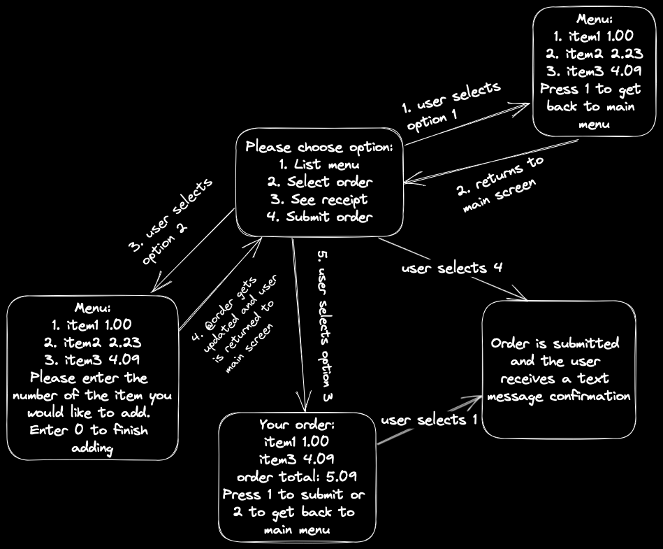

## Description

As a customer
So that I can check if I want to order something
I would like to see a list of dishes with prices.

As a customer
So that I can order the meal I want
I would like to be able to select some number of several available dishes.

As a customer
So that I can verify that my order is correct
I would like to see an itemised receipt with a grand total.

( twilio-ruby gem )
As a customer
So that I am reassured that my order will be delivered on time
I would like to receive a text such as "Thank you! Your order was placed and will be delivered before 18:52" after I have ordered.

## Design

class Takeaway
@menu:  [ {:name, :price} ]
@order: same as menu, updated through #select_order

def list_menu: returns @menu formatted with MenuPrinter
def select_order(): select items from menu by item number and add to order array
def see_receipt: displays the current order using MenuPrinter
def submit_order: sends message using Twilio and clears order order array
def run: starting method
def user_menu: menu manager dealing with IO

class Printer
def format_menu(array): returns a formatted string for given array
def user_menu: returns the user_menu as a string

## Examples
Simple order

